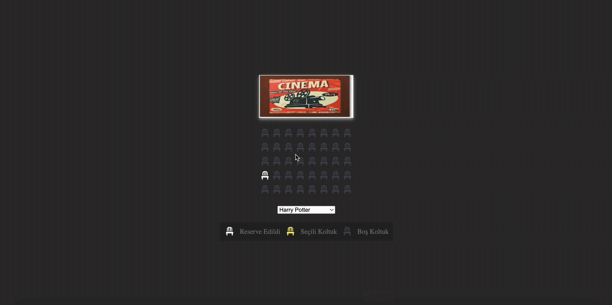

<h1>Cinema Project</h1>

- Kullanıcıların sinema salonunda koltuk rezervasyonu yapabilecekleri bir web uygulamasıdır.

- Film seçimi yapılabilir ve filmlerin ücretleri değişkenlik gösterir.

- Rezervasyon yapılan koltuk sayısına göre filmlerin toplam ücretleri hesaplanır.

<h2>Kullanılan Teknolojiler</h2>

HTML, CSS ve JavaScript kullanıldı.

<h2>Ekran Goruntusu</h2>

